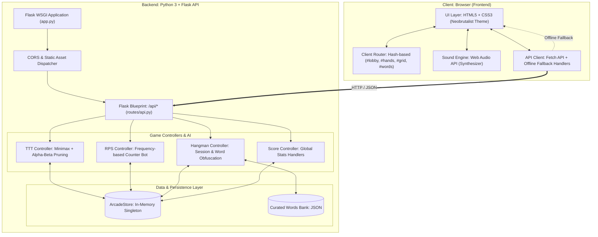

# 🏛️ Paper Arcade — Architecture & Technology Specification

A comprehensive technical reference documenting the architectural decisions, design patterns, algorithmic implementations, and alternative technology trade-offs for **Paper Arcade**.

---

## 📑 Table of Contents

- [1. System Overview & Architecture](#1-system-overview--architecture)
- [2. Technology Stack Breakdown & Rationale](#2-technology-stack-breakdown--rationale)
  - [2.1 Backend Server & Routing](#21-backend-server--routing)
  - [2.2 Tic-Tac-Toe AI Engine](#22-tic-tac-toe-ai-engine)
  - [2.3 Rock-Paper-Scissors Predictive Bot](#23-rock-paper-scissors-predictive-bot)
  - [2.4 Hangman Session & Obfuscation Engine](#24-hangman-session--obfuscation-engine)
  - [2.5 In-Memory State & Score Management](#25-in-memory-state--score-management)
  - [2.6 Frontend Client & Routing](#26-frontend-client--routing)
  - [2.7 Procedural Web Audio Engine](#27-procedural-web-audio-engine)
  - [2.8 Design System & Styling](#28-design-system--styling)
- [3. Function-by-Function Reference & Technology Matrix](#3-function-by-function-reference--technology-matrix)
- [4. Alternative Technology Trade-Off Matrix](#4-alternative-technology-trade-off-matrix)
- [5. Scalability & Extensibility Roadmap](#5-scalability--extensibility-roadmap)

---

## 1. System Overview & Architecture

Paper Arcade is a decoupled fullstack web application consisting of a **Python (Flask)** REST backend and a **Vanilla JavaScript (ES6 Modules)** frontend rendered with a retro Neobrutalist paper aesthetic.



---

## 2. Technology Stack Breakdown & Rationale

### 2.1 Backend Server & Routing
* **Files:** [`backend/app.py`](backend/app.py), [`backend/routes/api.py`](backend/routes/api.py)
* **Primary Technologies:** Python 3.10+, Flask 3.0+, `flask-cors`

#### Why Chosen:
1. **Lightweight Footprint:** Flask is a micro-framework with zero required boilerplate or database configuration.
2. **Modular Blueprints:** `Blueprint` decouples routing from server boot logic, keeping controller endpoints clean under `/api/*`.
3. **Unified Single-Process Delivery:** Serves both API endpoints and frontend static assets (with single-page application fallback) out of a single process.

#### Alternatives:
* **FastAPI:** Provides automatic OpenAPI/Swagger documentation and asynchronous request processing (via Starlette/Pydantic). Recommended if the backend grows to support concurrent multiplayer WebSockets.
* **Express.js / Fastify (Node.js):** Unifies language across frontend and backend (fullstack JavaScript/TypeScript), eliminating context switching.
* **Go (Gin / Fiber):** Provides high-throughput, low-latency compiled binary deployment with tiny RAM usage.

---

### 2.2 Tic-Tac-Toe AI Engine
* **File:** [`backend/controllers/ttt_controller.py`](backend/controllers/ttt_controller.py)
* **Primary Technologies:** Minimax Algorithm, Alpha-Beta Pruning, Python `math` & `random`

#### Why Chosen:
1. **Mathematical Optimality:** Minimax explores the deterministic zero-sum game tree, guaranteeing the bot cannot lose when set to "Impossible".
2. **Alpha-Beta Pruning:** Cuts off evaluation branches that cannot influence the final decision, reducing visited states from over 50,000 recursive calls to under 2,000 for a fresh board.
3. **Stochastic Difficulty Gradation:** Dynamically blends random choices with optimal minimax evaluations to support *Easy* (100% random), *Medium* (35% random, 65% minimax), and *Impossible* (100% minimax) modes.

#### Alternatives:
* **Precomputed Hash Table / Opening Book:** Because Tic-Tac-Toe has only 765 unique symmetrical states, all optimal moves can be cached in a JSON lookup table for $O(1)$ response time.
* **Q-Learning (Reinforcement Learning):** An agent that learns optimal moves through tabular self-play.
* **Client-Side Pure JS Minimax:** Runs computation directly on the client's browser, eliminating network latency entirely (already included as an offline fallback in `frontend/js/api.js`).

---

### 2.3 Rock-Paper-Scissors Predictive Bot
* **File:** [`backend/controllers/rps_controller.py`](backend/controllers/rps_controller.py)
* **Primary Technologies:** Frequency Analysis, Counter-Strategy Heuristics, $\epsilon$-Greedy Exploration

#### Why Chosen:
1. **Exploiting Cognitive Bias:** Humans struggle to generate true randomness and frequently repeat winning choices or cycle predictably.
2. **Frequency Counter Model:** Analyzes the player's historical move distribution and throws the move that beats their most frequent choice.
3. **$\epsilon$-Greedy Randomness ($\approx 30\%$):** Prevents the bot from falling into repetitive counter-traps if the human intentionally plays against the bot's logic.

#### Alternatives:
* **Markov Chain / N-Gram Predictor:** Predicts player transitions based on the preceding $N$ moves (e.g., $P(\text{Paper} \mid \text{Rock, Scissors})$).
* **Iocaine Powder Algorithm:** Uses multiple meta-strategies to counter the player's second- and third-order adaptation patterns.
* **Nash Equilibrium (`random.choice`):** Uniform $1/3$ probability per move. Mathematically unexploitable, but does not actively punish human patterns.

---

### 2.4 Hangman Session & Obfuscation Engine
* **Files:** [`backend/controllers/hangman_controller.py`](backend/controllers/hangman_controller.py), [`backend/data/words.json`](backend/data/words.json)
* **Primary Technologies:** Python `uuid`, Python `set` Data Structure, Categorized JSON Word Bank

#### Why Chosen:
1. **Server-Authoritative Obfuscation:** The secret word is retained only on the server inside an active session mapped to a UUID. The client receives only masked representations (`_ _ _ _`), making it impossible to cheat using browser DevTools or Network tabs.
2. **$O(1)$ Membership Lookups:** Uses Python `set` for guessed letters to evaluate hits/misses in constant time.
3. **Structured Word Bank:** Categorized JSON file loaded into memory once at startup for instant word pool extraction.

#### Alternatives:
* **Signed/Encrypted JWT Tokens:** Makes the server completely stateless by passing an encrypted payload holding the secret word and guess history to the client.
* **Redis Key-Value Cache:** Provides session expiration (TTL) and cluster-wide session sharing across multiple server instances.
* **External Dictionary APIs (e.g. Datamuse, WordsAPI):** Dynamically fetches an infinite pool of words, at the cost of external network latency and rate limits.

---

### 2.5 In-Memory State & Score Management
* **Files:** [`backend/data/store.py`](backend/data/store.py), [`backend/controllers/score_controller.py`](backend/controllers/score_controller.py)
* **Primary Technologies:** Python Class Singleton (`ArcadeStore`), Dictionary/List Collections

#### Why Chosen:
1. **Sub-Millisecond Read/Write:** Direct RAM access with zero database setup or migration overhead.
2. **Unified Game State:** Consolidates scores, win streaks, match histories, and round counters across all games in a single store.

#### Alternatives:
* **SQLite with SQLAlchemy:** Lightweight embedded SQL database that persists scores and user records across server restarts.
* **PostgreSQL / MySQL:** Relational persistence for production setups with user authentication, global leaderboards, and analytics.
* **Browser `localStorage` (Client-Side Persistence):** Stores scores entirely on the client device (used as the offline fallback mode).

---

### 2.6 Frontend Client & Routing
* **Files:** [`frontend/js/app.js`](frontend/js/app.js), [`frontend/js/api.js`](frontend/js/api.js), [`frontend/index.html`](frontend/index.html)
* **Primary Technologies:** Vanilla JavaScript (ES6 Modules), Hash-Based Routing (`window.location.hash`), Fetch API with Offline Fallbacks

#### Why Chosen:
1. **Zero Build Tools / Zero Bundler:** Runs natively in any modern browser without Webpack, Vite, or Babel.
2. **Hash-Based SPA Routing:** Seamless tab/view switching without full page reloads, fully compatible with static file hosts and local environments.
3. **Graceful Offline Degradation:** If the Flask backend goes offline, the `api.js` client automatically intercepts errors and switches to client-side game logic seamlessly.

#### Alternatives:
* **React / Vue / Svelte:** Component-based UI frameworks. Adds reactive state management, but introduces build tooling and larger bundle sizes.
* **HTML5 History API (`pushState`):** Provides clean URL paths (e.g., `/grid` instead of `#grid`), but requires server wildcard rewrite rules.
* **TanStack Query / Axios:** Handles automatic retry logic, query caching, and request deduplication.

---

### 2.7 Procedural Web Audio Engine
* **File:** [`frontend/js/sound.js`](frontend/js/sound.js)
* **Primary Technologies:** HTML5 Web Audio API (`AudioContext`, `OscillatorNode`, `GainNode`)

#### Why Chosen:
1. **Zero External Asset Overhead:** Generates tactile clicks, pencil marks, card flips, win arpeggios, and defeat slides programmatically via mathematical waveforms.
2. **Instant Playback (0 Latency):** No network requests, audio decoding latency, or missing MP3 asset errors.
3. **Ultra-Lightweight:** Full sound engine is under 7 KB of JavaScript.

#### Alternatives:
* **HTML5 Audio Elements with Static Audio Files (.mp3 / .wav):** Allows sampled acoustic instruments, but requires loading external asset files.
* **Tone.js:** Synthesizer and music composition framework for complex melodies (adds ~150 KB bundle overhead).
* **Howler.js:** Audio helper for multi-channel audio sprite playback and spatial panning.

---

### 2.8 Design System & Styling
* **File:** [`frontend/css/paper-arcade.css`](frontend/css/paper-arcade.css)
* **Primary Technologies:** Vanilla CSS3, CSS Custom Properties (Variables), CSS Grid & Flexbox, Neobrutalist Paper Aesthetic

#### Why Chosen:
1. **Tactile Theme:** Uses graph paper background grids, hard shadows (`box-shadow: 3px 3px 0px #000`), chunky borders, and typewriter/mono typography to emulate a physical paper notebook.
2. **Responsive Layouts:** CSS Grid and Flexbox handle fluid adaptation across mobile screens and desktop monitors without UI breakage.
3. **Zero Framework Dependency:** Avoids CSS framework bloat and provides granular control over micro-interactions and transitions.

#### Alternatives:
* **Tailwind CSS:** Utility-first CSS framework with rapid prototyping, but requires a build pipeline.
* **Sass / SCSS:** Preprocessor adding nesting and mixins.
* **CSS Modules / Styled Components:** Scoped component styling within modern frontend frameworks.

---

## 3. Function-by-Function Reference & Technology Matrix

| Module | Function / Class | Core Technology | Primary Purpose | Alternative Option |
| :--- | :--- | :--- | :--- | :--- |
| **`app.py`** | `serve_frontend()` | Flask `send_from_directory` | SPA static asset and HTML fallback delivery | Nginx / Cloudflare CDN |
| **`api.py`** | `api_bp` | Flask `Blueprint` | Prefixing and isolating REST routes (`/api/*`) | Flask-RESTX / FastAPI Routers |
| **`ttt_controller.py`** | `check_winner()` | Index Matrix Iteration | Evaluates 8 winning combos & draw state in $O(1)$ | Bitboard bitwise operations |
| **`ttt_controller.py`** | `minimax()` | Recursive Tree Search + $\alpha$-$\beta$ Pruning | Calculates the optimal move for unbeatable AI bot | Precomputed JSON lookup table |
| **`ttt_controller.py`** | `handle_ttt_move()` | Stochastic Blending | Applies difficulty setting (Easy/Medium/Impossible) | Depth-capped minimax |
| **`rps_controller.py`** | `get_bot_move()` | Frequency Counter + $\epsilon$-Greedy | Predicts player moves and counters frequent choices | Markov Chain / N-Gram model |
| **`rps_controller.py`** | `handle_rps_play()` | Map Lookups (`WIN_MAP`) | Evaluates round outcomes and updates series scores | Modulo arithmetic `(p - b) % 3` |
| **`hangman_controller.py`**| `start_hangman_game()`| `uuid.uuid4()` + JSON Pool | Creates a secure session with an obfuscated secret word | Stateless JWT token |
| **`hangman_controller.py`**| `guess_hangman_letter()`| Python `set` Lookup | Validates guesses, masks unrevealed letters, checks win/loss | Regular expression substitution |
| **`store.py`** | `ArcadeStore` | Python In-Memory Singleton | Stores real-time scores, streaks, and match history | SQLite / Redis Key-Value Store |
| **`sound.js`** | `SoundFX.init()` | `AudioContext` & `GainNode` | Initializes procedural audio graph & master volume | Howler.js / Tone.js |
| **`sound.js`** | `SoundFX.playWin()` | Oscillator Arpeggio (C5-E5-G5-C6) | Synthesizes triumphant 4-note victory chime | Pre-rendered 8-bit `.wav` file |
| **`api.js`** | `api.makeTttMove()` | `fetch()` + Client Fallback | Sends move to backend with offline simulation fallback | Axios + Service Worker Cache |
| **`app.js`** | `PaperArcadeApp.navigate()`| `window.location.hash` | Single Page Application (SPA) view switching | HTML5 History API (`pushState`) |
| **`hangman.js`** | `HangmanGame.updateSVG()`| Dynamic SVG DOM Elements | Draws gallows and body strokes on paper canvas | HTML5 `<canvas>` 2D context |

---

## 4. Alternative Technology Trade-Off Matrix

```
┌───────────────────────────┬──────────────────────────────────┬──────────────────────────────────┐
│ Component Area            │ Current Technology               │ Recommended Production Upgrade   │
├───────────────────────────┼──────────────────────────────────┼──────────────────────────────────┤
│ Backend Framework         │ Python Flask 3.0                 │ FastAPI (Async + Pydantic docs)  │
│ Database & Persistence    │ In-Memory Python Singleton       │ SQLite (Dev) / PostgreSQL (Prod) │
│ Session Management        │ Python Dict + UUID               │ Redis Key-Value Cache (with TTL) │
│ Multiplayer Support       │ Single Player / Local PvP        │ WebSockets (Socket.IO / ws)      │
│ Audio Engine              │ Web Audio API Procedural Synth   │ Howler.js + Custom 8-bit Audio   │
│ Client Framework          │ Vanilla JavaScript (ES6 Modules) │ Svelte 5 / React 19              │
│ Styling Architecture      │ Vanilla CSS3 Custom Properties   │ Tailwind CSS + CSS Modules       │
└───────────────────────────┴──────────────────────────────────┴──────────────────────────────────┘
```

---

## 5. Scalability & Extensibility Roadmap

```
                          ┌──────────────────────────────────────────────┐
                          │         FUTURE EXTENSIBILITY ROADMAP         │
                          └──────────────────────┬───────────────────────┘
                                                 │
            ┌────────────────────────────────────┼────────────────────────────────────┐
            ▼                                    ▼                                    ▼
┌───────────────────────┐            ┌───────────────────────┐            ┌───────────────────────┐
│   Online Multiplayer  │            │ Persistent Analytics  │            │ Progressive Web App   │
├───────────────────────┤            ├───────────────────────┤            ├───────────────────────┤
│ • Add WebSocket relay │            │ • SQLite / PostgreSQL │            │ • Service Worker      │
│ • Matchmaking lobbies │            │ • User registration   │            │ • Installable to home │
│ • Real-time PvP sync  │            │ • Global leaderboards │            │ • Full offline cache  │
└───────────────────────┘            └───────────────────────┘            └───────────────────────┘
```

---

*Document generated for **Paper Arcade** — clean, modular, fullstack architecture.*
